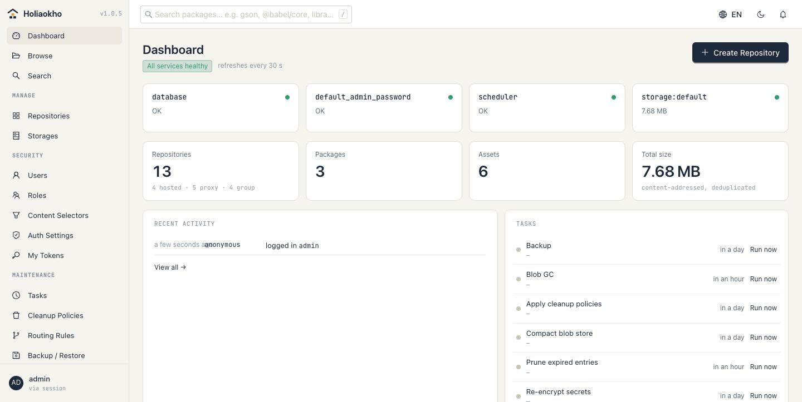
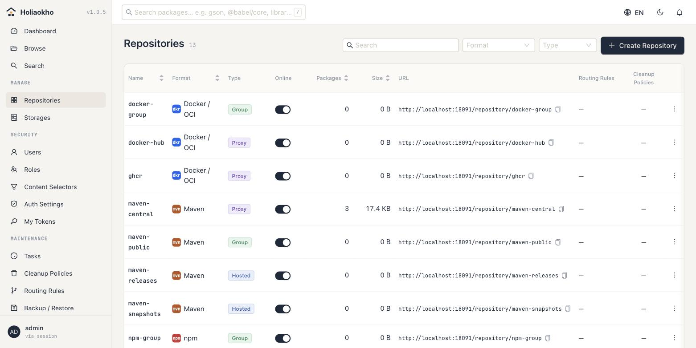
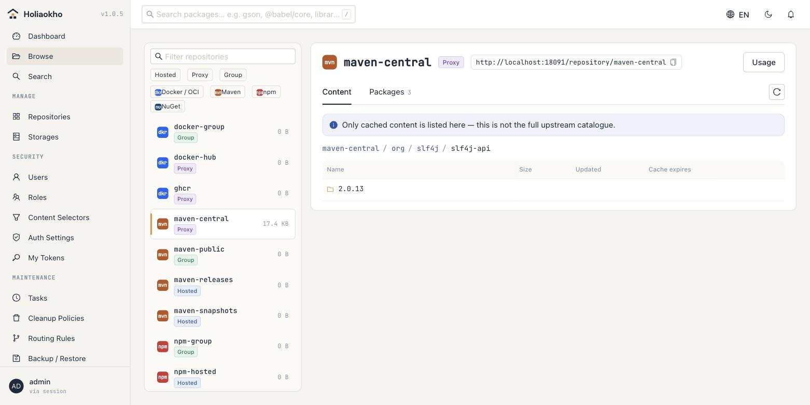
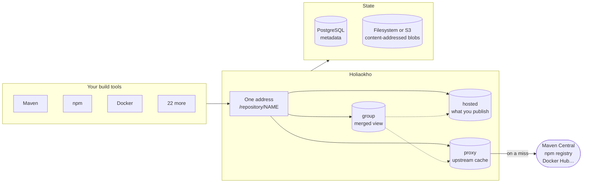

<div align="center">


# Holiaokho 好料庫

**hó-liāu-khòo** — Taiwanese for *the place you keep the good stuff*

A self-hosted artifact repository for 25 package formats.<br>
Built to replace Sonatype Nexus without asking anyone to change how they work.

[English](README.md) · [繁體中文](README.zh-TW.md) · [holiaokho.andyshiu.com](https://holiaokho.andyshiu.com)

</div>

[](LICENSE)
[](https://github.com/AndyShiu/holiaokho/actions/workflows/security.yml)
[](https://github.com/AndyShiu/holiaokho/releases)
[](https://github.com/AndyShiu/holiaokho/pkgs/container/holiaokho)

Holiaokho stores the packages your builds depend on and the artefacts they
produce — Maven, npm, Docker/OCI, PyPI, NuGet and twenty more — behind one
address, one binary and one PostgreSQL database.

## Why this instead of what you have

**Switching does not hurt.** Repository paths, the Docker port connectors and
the credential model follow Nexus conventions. A production cut-over ran on the
same host and the same ports without changing one line of CI configuration.

**It is small.** A single Go binary. No JVM, no plugins, no application server.
It starts serving in seconds and runs comfortably in a few hundred megabytes —
under real CI load, with several pipelines pulling at once.

**It keeps working when upstream does not.** Cached artefacts are still served
while a public registry is unreachable, so a bad afternoon at Maven Central
does not stop your builds. Upstreams that keep failing are blocked
automatically instead of making every request wait out a timeout.

**Nothing is held back for a paid tier.** There is no paid tier.

## Quick start

```sh
docker compose -f deploy/docker-compose.yml up -d
```

Then open <http://localhost:8081/ui/>. The first login uses the password from
`HOLIAOKHO_ADMIN_PASSWORD`, and the account cannot do anything else until that
password is changed — a password somebody else chose is a password too many
people know.

Point a client at it exactly as you would at Nexus:

```sh
# Maven: settings.xml
<mirror><id>holiaokho</id><url>http://localhost:8081/repository/maven-public/</url><mirrorOf>*</mirrorOf></mirror>

# npm
npm config set registry http://localhost:8081/repository/npm-group/

# Docker (path mode, no extra port needed)
docker pull localhost:8081/docker-hub/alpine:3.19
```

A fresh install creates the same starter repositories Nexus would, plus a
Docker group on port 8082 so a daemon's `registry-mirrors` has somewhere to
point.

## What it looks like



<details>
<summary>Repository management, and browsing cached content</summary>

<br>





</details>

## How it fits together



Metadata lives in PostgreSQL; file contents live in a content-addressed blob
store, so the same bytes referenced by ten repositories occupy the disk once.
A proxy repository serves what it has cached and only reaches upstream on a
miss — which is why it keeps working when upstream does not.

## What it does

**25 package formats**, each verified against its official client running in
Docker (`scripts/e2e-formats.sh`): Maven, npm, Docker/OCI, PyPI, raw, NuGet,
Helm, Go, APT, YUM, Alpine, RubyGems, Cargo, Composer, Conda, R/CRAN, p2,
CocoaPods, Terraform, pub, Git LFS, Hugging Face, Ansible Galaxy, Conan, Swift.
Hosted, proxy and group for every one of them.

**Access control** — local accounts (argon2; Nexus Shiro hashes accepted on
import), LDAP, OIDC, reverse-proxy header auth. Roles read as targets times
actions, down to a single repository; content selectors narrow that further by
path. User tokens, login rate limiting, a password policy.

**Operations** — routing rules, cleanup policies with a preview, soft delete
and compacting GC, storage quotas, cron-scheduled tasks, webhooks with HMAC
signing, e-mail, an audit log, backup and restore including blobs, Prometheus
metrics.

**Supply chain** — the OCI referrers API. Signatures, SBOMs and build
attestations that `cosign` and `syft` attach to an image are stored as what
they are, and found again through the same endpoint the tools already ask.
Proxy repositories answer from upstream and cache the result; the web
interface lists what is attached to each image.

**Vulnerability scanning** — stored packages are checked against
[OSV](https://osv.dev) for known vulnerabilities: Maven, npm, PyPI, Go, NuGet,
RubyGems, Cargo, Composer, pub and CRAN. One row per actual vulnerability
(GHSA, CVE and ecosystem ids merged), worst first, with the versions that fix
it. Newly found critical and high findings are sent once by email and webhook
and flagged on the dashboard. Formats OSV does not cover are reported as not
covered — never as clean. On by default; any repository can opt out.

**Storage** — local filesystem or any S3-compatible service, content-addressed
and reference-counted, so an identical file referenced by ten repositories
occupies the disk once.

**A web interface** — in Traditional Chinese, Simplified Chinese, English,
Japanese and Korean, with a dark mode that was actually looked at.

## Configuration

Every key in [`config.example.yaml`](config.example.yaml) can be set as a
`HOLIAOKHO_*` environment variable instead. Kubernetes manifests are in
[`deploy/k8s/`](deploy/k8s/).

**Outbound connections.** Besides the upstreams you configure, the server
makes two kinds of request on its own. Both can be turned off, and both go
through the same outbound proxy and CA settings as everything else:

| What | Where | Sends | Turn off |
|---|---|---|---|
| Vulnerability scanning | `api.osv.dev` | package names and versions | `HOLIAOKHO_VULNERABILITIES_ENABLED=false` |
| New-release check, daily | `api.github.com` | a User-Agent with the version, nothing else | `HOLIAOKHO_UPDATES_CHECK=false` |

## Documentation

- [`docs/nexus-feature-parity.md`](docs/nexus-feature-parity.md) — what Nexus
  does and whether this does it
- [`docs/security.md`](docs/security.md) — the trust boundaries, what is
  protected, and what is knowingly not
- [`docs/holiaokho-ui-brief.md`](docs/holiaokho-ui-brief.md) — the interface
  specification, if you are working on the UI

## Security

Every push is scanned, and the results are public — the badge above links to
them rather than asking you to take this section's word for it.

| | |
|---|---|
| **Gitleaks** | Credentials, across the full commit history rather than the current tree |
| **Trivy** | Dependency vulnerabilities, secrets, and Kubernetes/Dockerfile misconfiguration |
| **Trivy** | The published container image |
| **govulncheck** | Go vulnerabilities that this code actually reaches, not just version matches |
| **staticcheck**, **go vet** | Static analysis |

Containers run as a non-root user with a read-only root filesystem and every
Linux capability dropped — verified by running them that way, not only by
passing a scanner.

A clean scan is not the same as being secure.
[`docs/security.md`](docs/security.md) describes the trust boundaries, what is
protected, and what is knowingly not.

## Contributing

Bug reports and patches are welcome. See [CONTRIBUTING.md](CONTRIBUTING.md);
pull requests need a signed [CLA](CLA.md).

Security problems should go through GitHub's private vulnerability reporting
rather than a public issue — see [SECURITY.md](SECURITY.md).

## License

[Apache License 2.0](LICENSE). Copyright 2026 Pei-En Hsu.
