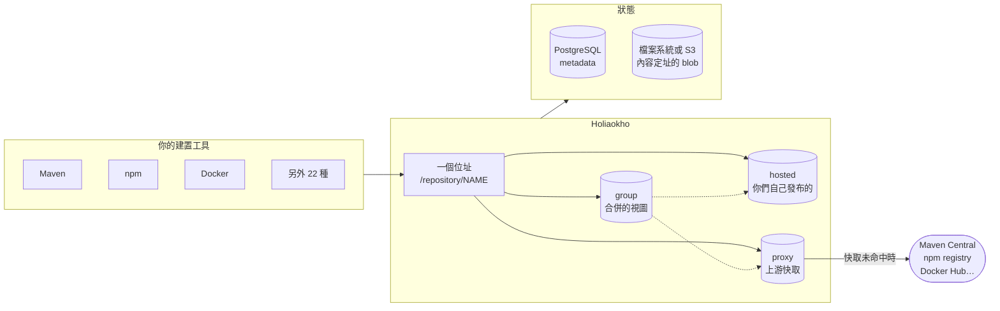

<div align="center">


# Holiaokho 好料庫

**hó-liāu-khòo** —— 台語「好料」是好東西、好材料,「庫」是存放的地方

自架的套件倉庫,支援 25 種格式。<br>
設計目標是取代 Sonatype Nexus,而且不要求任何人改變原本的工作方式。

[繁體中文](README.zh-TW.md) · [English](README.md) · [holiaokho.andyshiu.com](https://holiaokho.andyshiu.com)

</div>

[](LICENSE)
[](https://github.com/AndyShiu/holiaokho/actions/workflows/security.yml)
[](https://github.com/AndyShiu/holiaokho/releases)
[](https://github.com/AndyShiu/holiaokho/pkgs/container/holiaokho)

好料庫存放你們建置時依賴的套件,以及每次建置產出的成果 —— Maven、npm、
Docker/OCI、PyPI、NuGet 等 25 種格式,全部在同一個位址、同一個執行檔、
同一個 PostgreSQL 後面。

## 為什麼要換掉現在用的

**搬過來不會痛。** repository 路徑、Docker 連接埠、帳號模型都沿用 Nexus 的慣例。
實際做過一次正式環境切換:同一台主機、同樣的連接埠,CI 設定一行都沒改。

**它很小。** 單一 Go 執行檔,不需要 JVM、外掛或應用伺服器。幾秒內開始服務,
在真實 CI 負載下(多條 pipeline 同時拉套件)記憶體用量維持在數百 MB。

**上游壞掉時它還能出貨。** 已快取的內容在公開來源連不上時仍然供應,
Maven Central 出狀況的那個下午不會讓你們的建置全部停擺。
持續失敗的上游會被自動封鎖,而不是讓每個請求都去等逾時。

**沒有功能被留在付費版。** 因為沒有付費版。

## 快速開始

```sh
docker compose -f deploy/docker-compose.yml up -d
```

然後開啟 <http://localhost:8081/ui/>。第一次登入使用 `HOLIAOKHO_ADMIN_PASSWORD`
設定的密碼,而且在更換密碼之前,這個帳號不能做其他任何事 ——
別人幫你設的密碼,就是太多人知道的密碼。

客戶端的設定方式和 Nexus 完全一樣:

```sh
# Maven:settings.xml
<mirror><id>holiaokho</id><url>http://localhost:8081/repository/maven-public/</url><mirrorOf>*</mirrorOf></mirror>

# npm
npm config set registry http://localhost:8081/repository/npm-group/

# Docker(路徑模式,不需要額外的連接埠)
docker pull localhost:8081/docker-hub/alpine:3.19
```

全新安裝會建立和 Nexus 相同的起始 repository,另外加上綁在 8082 的 Docker
group,讓 daemon 的 `registry-mirrors` 有地方可以指。

## 長什麼樣子


<details>
<summary>Repository 管理,以及瀏覽已快取的內容</summary>

<br>


</details>

## 架構



metadata 存在 PostgreSQL,檔案內容存在內容定址的 blob 儲存區——
同一份位元組就算被十個 repository 引用,磁碟上也只有一份。
proxy repository 優先供應已快取的內容,只有未命中才連上游,
這也是它在上游故障時仍能出貨的原因。

## 它做些什麼

**25 種套件格式**,每一種都以官方 client 在 Docker 容器中實測過
(`scripts/e2e-formats.sh`):Maven、npm、Docker/OCI、PyPI、raw、NuGet、Helm、
Go、APT、YUM、Alpine、RubyGems、Cargo、Composer、Conda、R/CRAN、p2、
CocoaPods、Terraform、pub、Git LFS、Hugging Face、Ansible Galaxy、Conan、Swift。
每一種都支援 hosted、proxy 與 group。group 也能接受部署:對 group 執行
`mvn deploy`、`npm publish`、`twine upload` 或 `docker push`,內容會存進它的第一個
hosted 成員,建置只需要設定一個網址就能下載也能上傳。呼叫者必須同時對 group
與該成員有寫入權限。

**存取控制** —— 本機帳號(argon2;匯入時接受 Nexus 的 Shiro 雜湊)、LDAP、
OIDC、反向代理標頭認證。角色以「對象 × 動作」描述,可細到單一 repository;
內容選擇器再依路徑收窄。另有使用者權杖、登入頻率限制、密碼複雜度政策。

**維運** —— 路由規則、清理規則(含預覽)、軟刪除與壓實回收、儲存配額、
cron 排程任務、含 HMAC 簽章的 webhook、電子郵件、稽核紀錄、
含 blob 的備份還原、Prometheus 指標。

**供應鏈** —— OCI referrers API。`cosign`、`syft` 掛在 image 上的簽章、
SBOM 與建置證明會以它們原本的樣子保存,並透過工具本來就會問的同一個端點找回來。
proxy repository 會向上游詢問並快取結果;網頁介面會列出每個 image 掛了什麼。

**漏洞掃描** —— 以 [OSV](https://osv.dev) 檢查已存放的套件是否有已知漏洞:
Maven、npm、PyPI、Go、NuGet、RubyGems、Cargo、Composer、pub、CRAN。同一個漏洞的
GHSA、CVE 與各生態系編號合併為一筆,依嚴重度排序,並列出修復版本。新發現的 Critical
與 High 會以 email 和 webhook 通知一次,並在首頁提示。OSV 不支援的格式標為「未涵蓋」,
絕不標為「安全」。預設開啟,每個 repository 可以個別關閉。掃描結果可以匯出成報告:
PDF、Excel 給人看,CSV、JSON(附 purl)給程式與 AI agent 比對專案自己的依賴。

**儲存** —— 本機檔案系統或任何 S3 相容服務。內容定址並計算引用數,
所以同一個檔案就算被十個 repository 引用,磁碟上也只有一份。

**網頁介面** —— 繁體中文、簡體中文、English、日本語、한국어,
以及一個真的有人看過的深色模式。

## 設定

[`config.example.yaml`](config.example.yaml) 裡的每個設定都可以改用
`HOLIAOKHO_*` 環境變數。Kubernetes manifest 在
[`deploy/k8s/`](deploy/k8s/)。

**對外連線。** 除了你設定的上游之外,伺服器會自己發出兩種請求。兩者都可以關閉,
也都和其他連線一樣走對外 proxy 與 CA 設定:

| 用途 | 連到 | 送出內容 | 關閉方式 |
|---|---|---|---|
| 漏洞掃描 | `api.osv.dev` | 套件名稱與版本 | `HOLIAOKHO_VULNERABILITIES_ENABLED=false` |
| 每日檢查新版本 | `api.github.com` | 只有帶版本號的 User-Agent | `HOLIAOKHO_UPDATES_CHECK=false` |

## 文件

- [`docs/nexus-feature-parity.zh-TW.md`](docs/nexus-feature-parity.zh-TW.md) ——
  Nexus 有什麼,這邊有沒有
- [`docs/security.zh-TW.md`](docs/security.zh-TW.md) ——
  信任邊界、已經防護的部分,以及明知還沒做的部分
- [`docs/holiaokho-ui-brief.zh-TW.md`](docs/holiaokho-ui-brief.zh-TW.md) ——
  介面規格,要改 UI 時看這份

## 安全

每次推送都會掃描,結果是公開的——上面的 badge 直接連到那些結果,
不需要相信這一節說了什麼。

| | |
|---|---|
| **Gitleaks** | 憑證,掃的是完整 commit 歷史而非當前檔案 |
| **Trivy** | 相依套件漏洞、憑證,以及 Kubernetes / Dockerfile 設定 |
| **Trivy** | 發布的容器映像 |
| **govulncheck** | 這份程式碼實際會呼叫到的 Go 漏洞,而不只是版本比對 |
| **staticcheck**、**go vet** | 靜態分析 |

容器以非 root 使用者、唯讀根檔案系統、且不保留任何 Linux capability 執行——
這是實際那樣跑起來驗證的,不只是讓掃描器過關。

**掃描全過不等於安全。**
[`docs/security.zh-TW.md`](docs/security.zh-TW.md) 寫明信任邊界、已經防護的部分,
以及明知還沒做的部分。

## 參與

歡迎回報問題與送出修正。請先看 [CONTRIBUTING.md](CONTRIBUTING.md);
pull request 需要簽署 [CLA](CLA.md)。

安全性問題請透過 GitHub 的私密回報功能,不要開公開 issue ——
詳見 [SECURITY.md](SECURITY.md)。

## 授權

[Apache License 2.0](LICENSE)。Copyright 2026 Pei-En Hsu。
